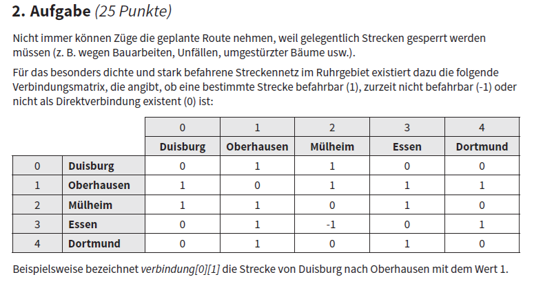
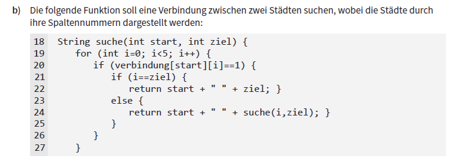
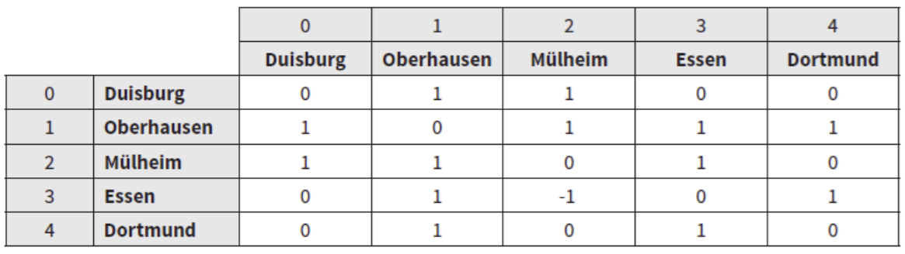
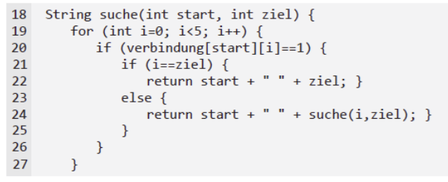
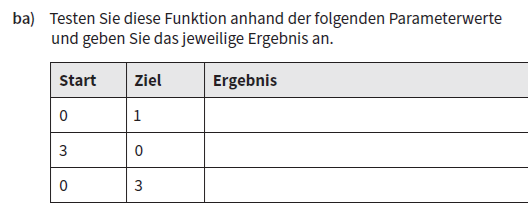
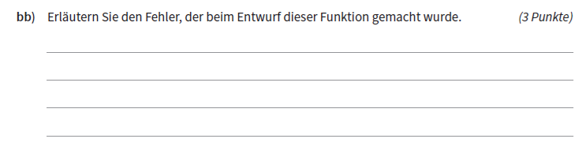
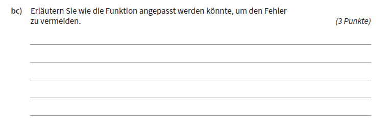
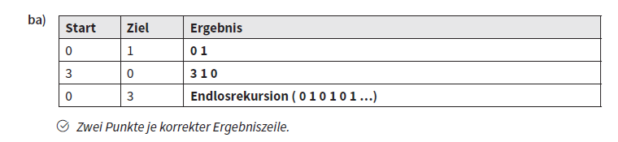

## Maximum berechnen

```pseudo
max = 0
FUER JEDES z IN liste
    WENN z > max DANN
        max = z
    ENDE WENN
ENDE FUER
```

Führen Sie einen Schreibtischtest durch:

Array | Ergebnis (max)
------|---------------
[1, 3, 5, 6, 8] |
[11, 3, -4, 7] |
[0, 0, 0] | 
[-5, -2, -7] |


## Maximum: Wo liegt der Fehler?

```pseudo
max = 0
FUER JEDES z IN liste
    WENN z > max DANN
        max = z
    ENDE WENN
ENDE FUER
```

Wo liegt der Fehler im Pseudocode?

[Notieren Sie die korrigierte Version des Codes.]{.fragment}


## Maximum: Lösung

```pseudo
max = liste[0]
FUER JEDES z IN liste
    WENN z > max DANN
        max = z
    ENDE WENN
ENDE FUER
```

::: {style="font-size: 2rem"}
Knackpunkt ist die Initialisierung des Maximums.

`max = 0` führt zu falschen Ergebnissen, falls die Liste nur negative Werte enthält.

Besser: Initialisierung mit dem ersten Element des Arrays <br> (in Python: Liste).

::: {.callout-note}
`z > max` ist übrigens richtig: `FUER JEDES ...` greift direkt auf das Element zu, nicht den Index!  
`WENN liste[z] > max` wäre bei der `FUER JEDES` (foreach)-Schleife falsch.
:::
:::


## Lineare Suche

```pseudo
position = 1
FUER JEDES z IN liste
    WENN z == gesucht DANN
        position = z
    ENDE WENN
ENDE FUER
AUSGABE position
```

Führen Sie einen Schreibtischtest durch. <br> (Erstes Element = Position 0)

Array (liste) | gesucht | Ergebnis: position
------|-------|--------
[1, 3, 5, 6, 8] | 5 | 
[11, 3, -4, 7] | 11 |
[0, 2, 0] | 0


## Lineare Suche: Lösung

```pseudo
position = 1
FUER JEDES z IN liste
    WENN z == gesucht DANN
        position = z
    ENDE WENN
ENDE FUER
AUSGABE position
```

::: {style="font-size: 2rem"}

Abbruchbedingung fehlt:

- Ineffizient, wenn Element früh gefunden wird und große Datenmenge übergeben wird
- Wenn Element mehrmals vorkommt, wird Position jeweils überschrieben

Außerdem Initialisierung falsch.

:::


## Ersten positiven Wert finden

Gegeben ist folgender Pseudocode, um den ersten positiven Wert in einem Array zu finden.

```pseudo
positiv = -1
FUER JEDES z IN liste
    WENN z > 0 DANN
        positiv = z
    ENDE WENN
ENDE FUER
```

::::: {style="font-size: 1.9rem"}
Was liefert der Pseudocode zurück?

:::: fragment

Pseudocode liefert **letzten** positiven Wert.

::: {.callout-note}
Aufgabenstellung genau lesen :-)
:::

::::
:::::

## Typische Prüfungsaufgabe




## Die Funktion




## Schreibtischtest

:::: columns
::: {.column width="55%"}




:::

::: {.column width="45%"}

<br>



:::
::::


## Wo liegt der Fehler?




## Abhilfe?




## Schreibtischtest: Lösung




## Wo liegt der Fehler?

Algorithmus sucht nicht alle Verbindungen in einer Zeile, sondern nur die erste fahrbare.

Dadurch Endlosschleife möglich.

Eventuelle bessere Alternative wird ignoriert.


## Abhilfe

Alle Verbindungen je Zeile prüfen.

Implementierung ist Bonusaufgabe ...
