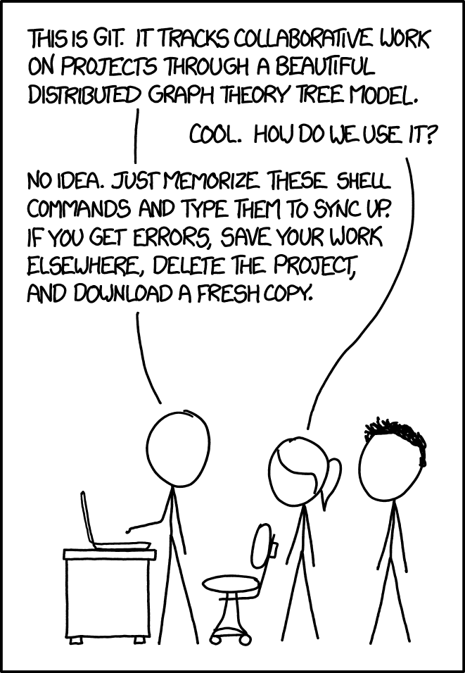
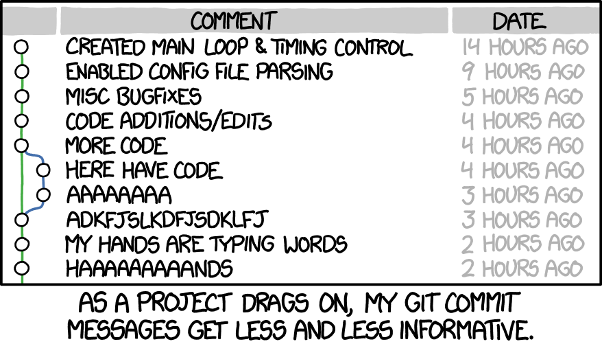

## Editor

## CI/CD

:::: {style="font-size: 1.6rem"}

Wie können automatische Kompilierung und Bereitstellung *(Continuous Integration und Continuous Deployment, kurz CI/CD)* implementiert werden?

::: {.incremental .fragment}

Die folgenden Schritte sollten zur **automatischen Kompilierung und Bereitstellung** im Allgemeinen befolgt werden:

1. ***Source Control Management (SCM):*** Alle Entwicklungsarbeit sollte in einem **Versionskontrollsystem** gespeichert werden.
2. **Automatische Kompilierung:** Wenn Änderungen im Versionskontrollsystem vorgenommen werden, wird ein automatisierter Build-Prozess ausgelöst.
3. **Automatisierte Tests:** Nach der Kompilierung sollte der Code automatisiert getestet werden.
4. **Automatisierte Bereitstellung:** Nach erfolgreichem Build und Test wird der Code automatisch bereitgestellt.
5. **Monitoring und Feedback:** Nach der Bereitstellung sollte der Zustand überwacht und bei Problemen Feedback gegeben werden.

:::
::::

::: notes
Lernkarte AP2 2025 Nr. 148
:::

## Compiler- und Interpretersprachen

::::: {style="font-size: 2rem"}

Nennen Sie je ein Beispiel für eine Compiler- und Interpretersprache.

:::: columns
::: {.column .fragment}

### Compilersprachen

- C
- C++
- Pascal

:::

::: {.column .fragment}

### Interpretersprachen

- Perl
- Python
- BASIC

:::
::::
:::::

::: notes
Lernkarte AP2 2025 Nr. 119
:::

## Compiler vs. Interpreter

:::: {.columns style="font-size: 1.8rem"}
::: {.column .fragment}

### Compiler

- Programm, das den gesamten Quellcode einer Programmiersprache analysiert und in einen ausführbaren Maschinencode übersetzt
- Der übersetzte Code kann später unabhängig vom Compiler ausgeführt werden.

:::

::: {.column .fragment}

### Interpreter

- Programm, das den Quellcode einer Programmiersprache Zeile für Zeile ausführt
- Analysiert Code zur Laufzeit, anstatt ihn vorab zu übersetzen
- Interpreter analysiert und führt jede Anweisung einzeln aus, wodurch eine direkte Interpretation des Codes ermöglicht wird

:::
::::

::: notes
Lernkarte AP2 2025 Nr. 118
:::

## Versionsverwaltung: Vorteile

:::: {.incremental style="font-size: 1.9rem"}

- ermöglicht die Nachverfolgung von Änderungen am Quellcode 
- erlaubt das einfache Zurücksetzen auf frühere Versionen, falls  Fehler auftreten oder unerwünschte Änderungen vorgenommen wurden
- ermöglicht die Zusammenarbeit mehrerer Entwickler an einem Projekt, da Änderungen nahtlos zusammengeführt werden können
- erleichtert das Testen neuer Funktionen oder Experimente, ohne die Integrität des Hauptprojekts zu gefährden
- trägt dazu bei, den Entwicklungsprozess transparenter zu gestalten

::::

::: notes
Lernkarte AP2 2025 Nr. 120
:::

## git: Die xkcd-Sicht

:::: {.columns style="font-size: 1.7rem"}
::: {.column}

[Quelle: <https://xkcd.com/1597/>]{style="font-size: 1.2rem"}

:::

::: {.column .fragment}

If that doesn't fix it, `git.txt` contains the phone number of a friend of mine who understands git. Just wait through a few minutes of *'It's really pretty simple, just think of branches as...'* and eventually you'll learn the commands that will fix everything.

[Quelle: <https://www.explainxkcd.com/wiki/index.php/1597:_Git>]{style="font-size: 1.2rem"}

:::
::::

---

### git: Pull, Push, Branches, Merge

:::: {.columns style="font-size: 1.8rem"}
::: {.column .fragment}

### Pull

- holt Änderungen vom entfernten Repository in ein lokales Repository

 

### Push

- sendet die lokalen Änderungen zum entfernten Repository

:::

::: {.column .fragment}

### Branch

- unabhängige Entwicklungslinie, z. B. für ein neues Feature oder einen Bugfix
- erlaubt, neue Features oder Bugfixes zu entwickeln, ohne den Hauptcode zu verändern

### Merge

- führt zwei Branches zusammen, z. B. den Feature-Branch mit dem Haupt-Branch
- dabei werden Änderungen kombiniert

:::
::::

::: notes
Lernkarte AP2 2025 Nr. 121
:::

## git commit: xkcd

[Quelle: <https://xkcd.com/1296/>]{style="font-size: 1.2rem"}

## <!-- -->

{fig-align="center" width="50%"}

::: {style="text-align: center; font-size: 1rem;"}
[©torange.biz](https://torange.biz/cup-coffee-30851) CC-BY 4.0
:::

::: {style="color: green; text-align: center; font-size: 2.8rem"}
**Viel Erfolg!**
:::