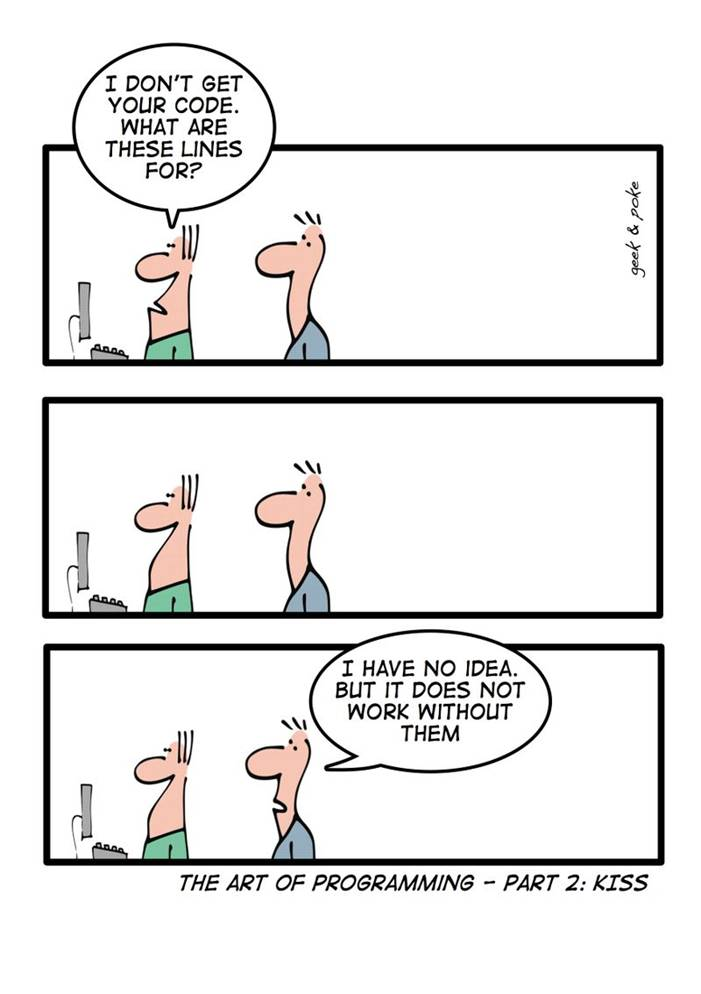

## Willkommen in LF10a!
`Benutzerschnittstellen gestalten und entwickeln`

::: {.content-visible when-profile="internal"}

::: {style="font-size: 1rem"}
Urheber: Geek and Poke, Oliver Widder  
<https://devhumor.com/media/the-art-of-programming>
:::
:::

::: {.content-visible when-profile="public"}
::: {style="font-size: 2rem"}
Cartoon *The Art of Programming*  
Geek and Code, Oliver Widder

<https://devhumor.com/media/the-art-of-programming>
:::
:::

## Willkommen in LF10a!

`Benutzerschnittstellen gestalten und entwickeln`

### Themenübersicht

- Algorithmen, Pseudocode, Datenstrukturen
- Software-Anforderungen
- UML, Modellierung, Analyse- und Designverfahren
- Werkzeuge und Entwicklungsumgebungen
- Benutzeroberflächen: UI / UX, Usability

## Zeitplan und Noten

- **Klassenarbeit** am Dienstag, 25. August zu Algorithmen, Pseudocode, Datenstrukturen
- **Klassenarbeit** am Dienstag, 29. September zu UML, Modellierung, Analyse- und Designverfahren
- **SOL** am 28. August, die am 29. September präsentiert und benotet wird
- **Praxisprojekt** vom 30. September bis 2. Oktober
- Präsentation des Praxisprojekts am Montag, 5. Oktober: Noten für Mitarbeit und fachliche Leistung
- Am Dienstag, 6. Oktober beginnt LF11a

## <!-- -->

{fig-align="center" width="50%"}

::: {style="text-align: center; font-size: 1rem;"}
[©torange.biz](https://torange.biz/cup-coffee-30851) CC-BY 4.0
:::

::: {style="color: green; text-align: center; font-size: 2.8rem"}
**Viel Erfolg!**
:::
